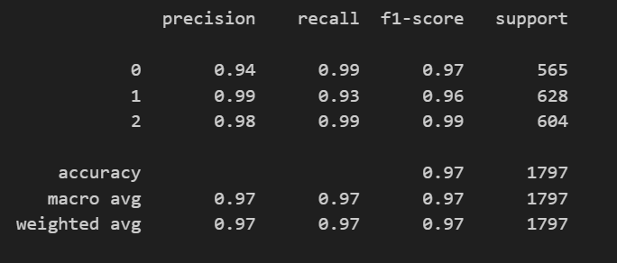

# Offensive Language Detection using Recurrent Neural Networks 

## 📖 **Abstract**

The widespread use of social media platforms has increased the prevalence of offensive language online, making it critical to develop automated systems for detecting harmful content. This project aims to classify social media posts, particularly tweets, into three categories: **hate speech**, **offensive language**, and **neutral language**. A **Recurrent Neural Network (RNN)** is used to model this problem, leveraging natural language processing (NLP) techniques for feature extraction and classification. The dataset contains 24,783 labeled tweets, and the model’s performance is evaluated using **accuracy**, **precision**, **recall**, and **F1-score**.

---

## 🛠 **Features**

- Classifies tweets into three categories: Hate Speech, Offensive Language, and Neutral.
- Uses a **Recurrent Neural Network (RNN)** for text classification.
- Implements Natural Language Processing (NLP) techniques for feature extraction.
- Performance metrics include **Accuracy**, **Precision**, **Recall**, and **F1-Score**.

---

## 📊 Results Summary

The detailed decription of the project, analysis and results are included in the [report](report.pdf)
