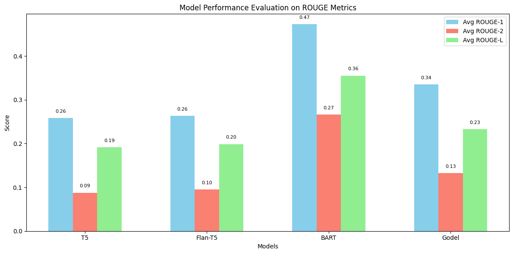
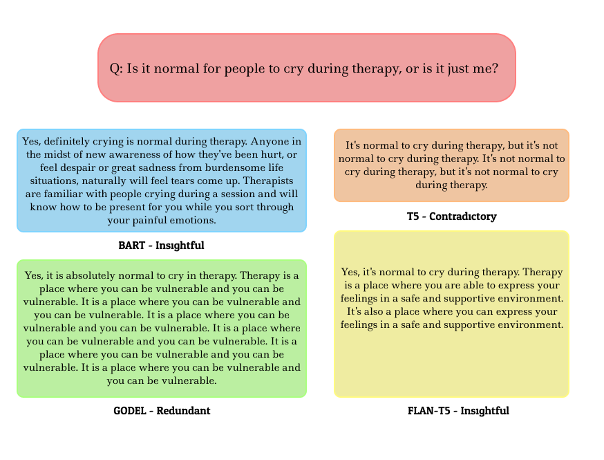
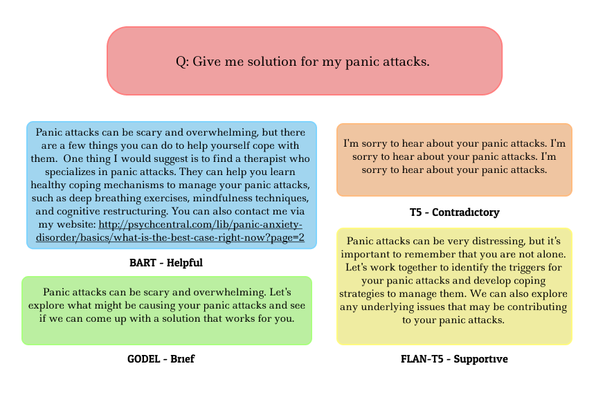

# Evaluating Lightweight Open-Source LLMs for Mental Health Counselling: A Comparative Study

This repository contains the code, datasets, and analysis for the project **"Evaluating Lightweight Open-Source LLMs for Mental Health Counselling: A Comparative Study"**. This study evaluates various lightweight LLMs, focusing on their potential to provide empathetic and context-aware responses for mental health counseling.

---

## 🔍 **Project Overview**

With the increasing application of AI in mental health, this project examines how well lightweight, open-source Large Language Models (LLMs) can generate meaningful and empathetic responses for counseling scenarios. The study focuses on:

- Fine-tuning models like **Flan-T5**, **BART**, **GODEL**, and **T5** on a curated dataset.
- Comparing these models based on their response fluency, coherence, and appropriateness.
- Evaluating their computational efficiency and suitability for deployment in real-world applications.

---

## 🚀 Key Features

- Fine-tuned multiple lightweight LLMs on a dataset specific to mental health scenarios.
- Evaluated models using:
  - **Perplexity**: Measuring fluency and grammar.
  - **Qualitative Metrics**: Contextual accuracy and empathy.
  - **Efficiency Metrics**: Training time and inference speed.

- Compared the trade-offs between performance and computational efficiency for lightweight models.

## Model Responses

## 📊 Results Summary

- **BART**: Best at generating contextually accurate and empathetic responses.
- **Flan-T5**: Efficient for deployment in resource-constrained environments, with reasonable response quality.
- **GODEL**: Strong at maintaining conversational context.
- **T5**: Performs well but requires more fine-tuning for empathetic applications.

The detailed decription of the project, analysis and results are included in the [research paper](Research_Paper_Comparitive_Analysis.pdf) 

## 🛠 Technologies Used

- **Programming Language**: Python
- **Frameworks/Libraries**: Hugging Face Transformers, PyTorch, TensorFlow, NumPy
- **Platforms**: Kaggle, Google Colab

