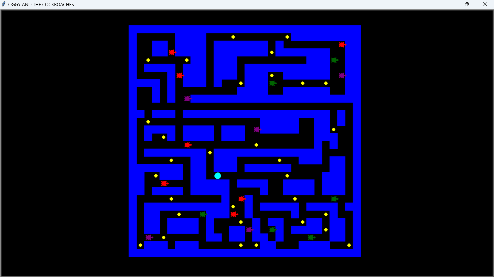

# Oggy and the Cockroaches - A Pac-Man Inspired Game

## About the Project
This is a fun, interactive Pac-Man-inspired game titled **Oggy and the Cockroaches**, created as part of an open-ended project. The game involves navigating a maze, collecting points, and avoiding cockroaches, all while striving for the highest score.

---

## Features
- Navigate through a maze as **Oggy**.
- Collect yellow points for a high score.
- Avoid cockroaches like **Dee Dee**, **Joey**, and **Marky**.
- Dynamic gameplay with real-time updates on the score and lives.
- Resettable game with a "Game Over" screen when lives reach zero.

---

## Game Objective
- **Score as high as possible** by collecting yellow points.
- **Avoid cockroaches**, as coming into contact with them reduces lives.
- Survive with your lives intact and keep collecting points for as long as possible.

---

## Technologies Used
- **Python**: For game logic and mechanics.
- **Turtle Graphics**: For creating the game visuals and animations.
- **Random**: For generating dynamic behaviors and random spawning.

---

## How to Play
1. Launch the game script using Python.
2. Use the arrow keys to navigate **Oggy**:
   - **Left Arrow**: Move left
   - **Right Arrow**: Move right
   - **Up Arrow**: Move up
   - **Down Arrow**: Move down
3. Collect yellow points (P) while avoiding cockroaches.
4. Monitor your score and lives at the top of the screen.
5. If you lose all your lives, the game will end and reset.

---
